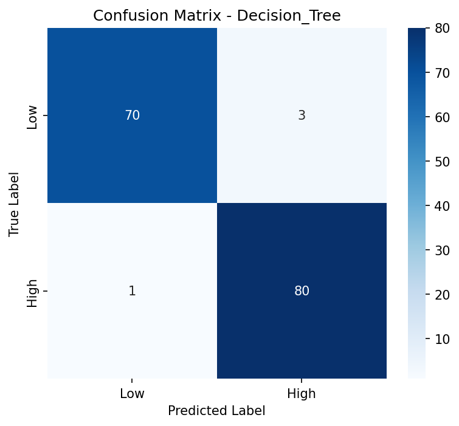
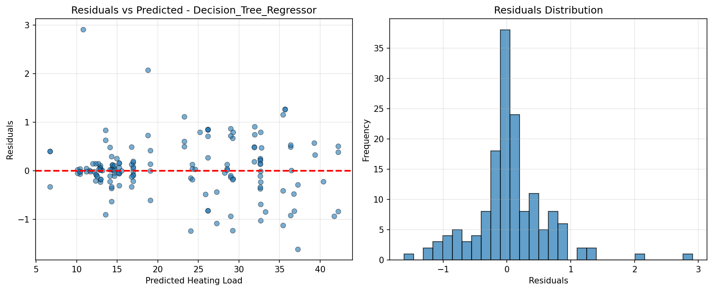
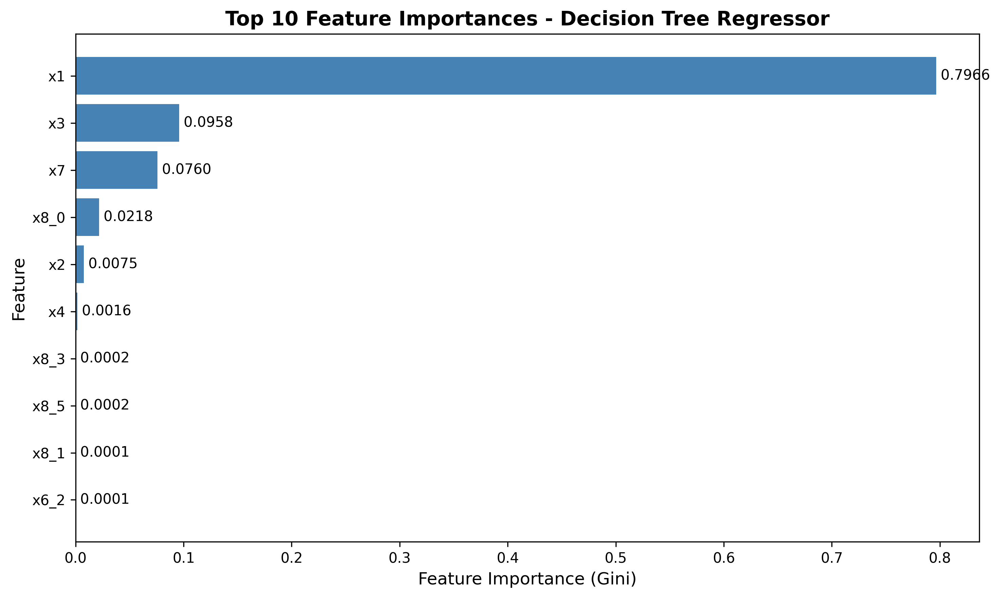

## 3. Comparative Analysis – Classical vs Neural Network

### Classification Results

Contrary to what we originally expected, we found that the Neural Networks couldn't improve on
the Decision Tree Model in either case. In terms of classification models, the Decision Tree
outperformed it in both Accuracy and F1 score across the validation and test sets. The Neural Network
classified a larger number of samples as "low" than the Decision Tree did, which points to one of its
limiting factor being tied to the decision boundary. Furthermore, the samples that were misclassified 
were often samples where the calculated heating load was much higher than the average for this data set,
namely, buildings with either an extremely large surface area or volume.

#### Table 1 – Classification comparison
| Model          | Val_Accuracy | Val_F1 | Test_Accuracy | Test_F1 |
|----------------|--------------|--------|--------|----------|
| Decision Tree  | 0.9870       | 0.9870 | 0.9740 | 0.9739 |
| Neural Network | 0.9416 | 0.9415 | 0.9610 | 0.9610 |

#### Plot 3: Confusion Matrix (Decision Tree)

### Regression Results

The Decision Tree Regressor model also proves itself to be most the effective regression
model of those tested. In this case, the Decision Tree model outperformed the Neural Network 
in all but one category, Validation set RMSE. From what we observed, the Neural Network
seemed to down weigh samples, leading to both a lower ceiling and lower floor than other models.
Furthermore, the Neural Network resulted in a wider residual spread than other models. This time, however,
the model appeared to have difficulty with samples containing lower heating loads, indicating a possible
underutilization of regularization within this model.

#### Table 2 – Regression comparison

| Model                   | Val_MAE | Val_RMSE | Test_MAE | Test_RMSE |
|-------------------------|---------|---------|----------|---------|
| Decision Tree Regressor | 0.3741  | 0.6009  | 0.3867   | 0.5801  |
| Neural Network          | 0.4342  | 0.5869  | 0.4360   | 0.6002  |

#### Plot 4: Residuals Plot (Decision Tree Regressor)

---

## 4. Improvement Analysis – Midpoint → Final
For this final submission, we have
- Added an MLPClassifier and MLPRegressor
- Used GridSearchCV hyperparameter tuning with 3-fold cross-validation
- Done some refractoring, including separating training scripts and reorganizing modules
- Tested multiple NN architectures/hyperparameters
- Added early stopping and validation monitoring to prevent overfitting

#### Table 3 – Classification Performance: Midpoint vs Final

| Model          | Midpoint Val F1 | Final Val F1 | Midpoint Test F1 | Final Test F1 | Change       |
|----------------|-----------------|--------------|------------------|---------------|--------------|
| Decision Tree  | 0.9870          | 0.9870       | 0.9739           | 0.9739        | No change    |
| Neural Network | N/A             | 0.9220       | N/A              | 0.9545        | **New model** |

**Key Observations:**
- Decision Tree F1: **0.9739** (test)
- Neural Network F1: **0.9545** (test)
- **Gap: ~2.0%** lower F1 for NN vs Decision Tree

#### Table 4 – Regression Performance: Midpoint vs Final

| Model                   | Midpoint Val MAE | Final Val MAE | Midpoint Test MAE | Final Test MAE | Change       |
|-------------------------|------------------|---------------|-------------------|----------------|--------------|
| Linear Regression       | 2.1449           | 2.1449        | 1.9285            | 1.9285         | No change    |
| Decision Tree Regressor | 0.3741           | 0.3741        | 0.3867            | 0.3867         | No change    |
| Neural Network          | N/A              | 0.4384        | N/A               | 0.4336         | **New model** |

**Key Observations:**
- Decision Tree MAE: **0.3867** (test)
- Neural Network MAE: **0.4336** (test)
- **Gap: ~12.1%** higher error for NN vs Decision Tree

#### Hyperparameter Tuning Results

**Grid Search Configuration:**
- **Search space tested:** 32 hyperparameter combinations
- **Method:** 3-fold cross-validation with GridSearchCV
- **Architectures:** (64,), (128,), (64,32), (128,64) hidden layer configurations
- **Learning rates:** 0.001, 0.01
- **Regularization (alpha):** 0.0001, 0.001, 0.01
- **Batch sizes:** 32, 64

**Best Hyperparameters Found:**

| Task           | Hidden Layers | Learning Rate | Alpha  | Batch Size | CV Score         |
|----------------|---------------|---------------|--------|------------|------------------|
| Classification | (64,)         | 0.01          | 0.0001 | 32         | 0.9576 (F1)      |
| Regression     | (64, 32)      | 0.001         | 0.0001 | 32         | 0.4850 (MAE)     |

Neural networks didn't outperform the decision tree. The dataset is too small for deep learning to shine,
and only 8 features makes the set not high-dimensional enough. Decision trees are more appropriate for
representing physical relationships like compactness and heating load in our case. NN seems too complex
for this problem type. There should be also a stronger feature interactions when working on physics problems
like such. At then end, we have found that a shallow network worked better than a deep one and we have been able
to limit overfitting through early stopping and GridSearchCV helped us a lot to find the best possible NN, though
it could not overcome the fundamental limitations of the problem.

Specifically, the NN achieved 95.45% test F1 for classification versus the Decision Tree's 97.39%, and for
regression, the NN's MAE of 0.4336 was 12% higher than the Decision Tree's 0.3867. The validation-test
gap was very small (and sometimes reversed), suggesting a slight underfitting rather than an overfitting. This
experience shows again that not all problems need neural networks—classical ML are the best on structured,
small tabular data where building physics has discrete, rule-based relationships that trees model naturally.

---

## 5. Risks, Ethics, and Limitations

Among the risks and limitations of these models are issues that arise with generalization and overfitting
due to regional architecture and non-standard designs. From the dataset, only 12
building shaped were simulated, meaning that it is highly probable that any new building
you attempt to plug into these models might not resemble one that exists within the
dataset and could cause the model's predictions to be highly inaccurate. Along this
line of thinking, it's likely that these results would be extremely region dependent.
Architecture and building shapes change to fit the needs of their respective cultures
and communities, meaning that a model trained on Canadian buildings could experience difficulty
in attempting to predict the heating load for buildings with european architecture.

In a similar vein, misuse of these predictions in cases of profiling or discrimination based on energy consumption.
Consider the following hypothetical situation: lets say the government implements
a new tax to discourage their citizens from wasting energy, any home that uses more than 20% over its predicted heating load in power
to heat their house must pay into this "green tax". However, if the models were only trained on certain building shapes, people
who live in irregularly shaped homes or apartments could face unjust taxation due to the lack of diversity in the training of the models.

The next steps for modeling energy efficiency would be to increase the number of samples
in the dataset, more specifically implementing some sort of cross-regional tests to ensure
diversity in the shape and design of structure samples.

---

## 6. Feature Importance and Interpretability

In order to understand which building features are the base for heating load predictions, we looked for the feature 
importance from the Decision Tree Regressor using its built-in feature_importances_ attribute, which measures 
Gini importance (how much each feature decreases weighted impurity across splits). Tree-based models provide a clear
interpretation compared to neural networks. After one-hot encoding categorical features like orientation and glazing
distribution, we analyzed importance across 14 total features.

#### Plot 5: Top 10 Feature Importances (Decision Tree Regressor)

#### Table 5 – Feature Importance Rankings

| Rank | Feature                        | Importance | Cumulative |
|------|--------------------------------|------------|------------|
| 1    | x1 (Relative Compactness)      | 0.7966     | 79.7%      |
| 2    | x3 (Wall Area)                 | 0.0958     | 89.2%      |
| 3    | x7 (Glazing Area)              | 0.0760     | 96.8%      |
| 4    | x8_0 (Glazing Distribution: 0) | 0.0218     | 99.0%      |
| 5    | x2 (Surface Area)              | 0.0075     | 99.8%      |
| 6    | x4 (Roof Area)                 | 0.0016     | 99.9%      |
| 7+   | All other features             | < 0.001    | 100.0%     |

The results align strongly with building physics principles. Relative Compactness (x1) is the strongest at 79.7%
importance because compact buildings have lower surface-area-to-volume ratios, which reduces heat loss through exterior 
surfaces. Wall Area (x3) ranks second at 9.6% as walls are the main heat loss points, with larger wall surfaces allowing 
more thermal energy to escape. Glazing Area (x7) contributes 7.6% since windows lose heat significantly faster than 
insulated walls, making total window area a key efficiency factor. Surface Area (x2) and Roof Area (x4) showing a minimal
importance despite their physical relevance, likely because they are highly related with compactness (-0.99 correlation 
from our midpoint analysis), causing the tree to select x1 as the more informative feature. Categorical features like 
orientation and glazing distribution were negligible. This suggests that building geometry dominates over directional or
distribution factors in this dataset.

This feature importance analysis explains clearly why Decision Trees outperformed Neural Networks in our experiments.
One dominant feature accounting for 80% of predictive power and the tree-based splits was highly effective. The model
can create simple, interpretable rules like "if compactness < 0.75, predict high heating load." Neural networks tries
to learn smooth, complex functions distributed across all features, but struggle when the importance is concentrated in
a single variable where threshold-based splitting is the best. This skew proves why our Decision Tree achieved superior
performance even though we have completed neural network hyperparameter tuning. In conclusion, prioritizing compactness 
is the single most effective action for improving energy efficiency.

