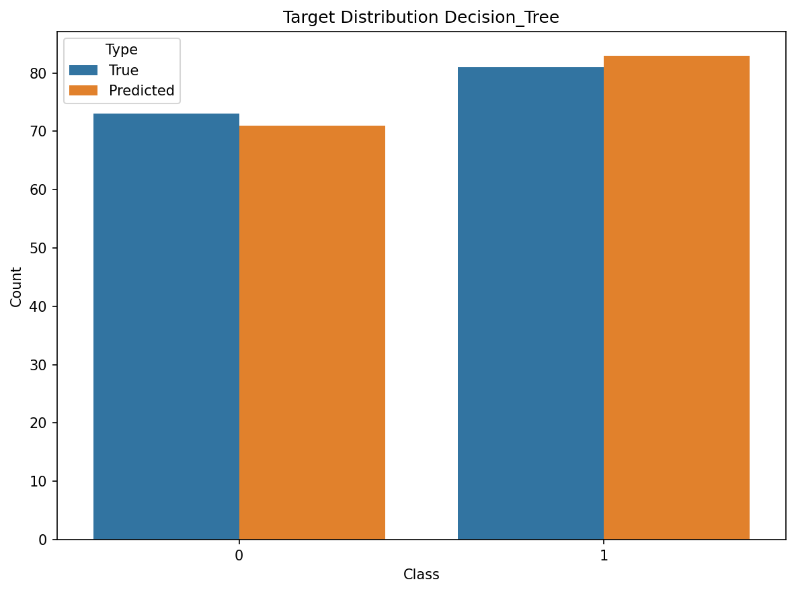
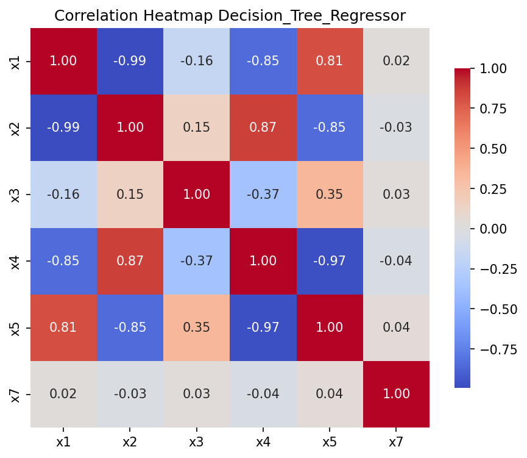
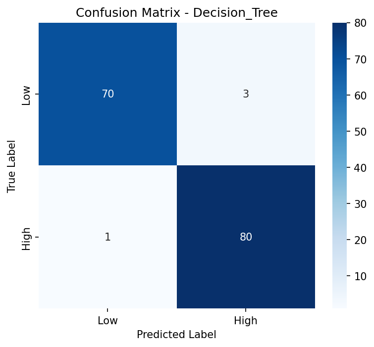
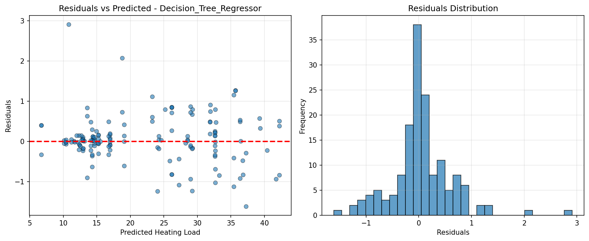

# CS-4120 Midpoint – Energy Efficiency Dataset
**Course:** CS-4120, Fall 2025  
**Team:** Tanguy Merrien & Alex Deboer

---
### Updated Dataset Description and Cleaning Notes
We are using the public domain energy efficiency dataset from the University of California, Irvine. 
This dataset counts 8 (X1-8) features across 768 samples, with the Heating Load (Y1) as the primary 
target and the Cooling Load (Y2) as the auxiliary. This is a complete dataset, meaning there are 
no missing values.

In terms of preprocessing, we identified which features were categorical and which were numeric. 
Then, we one-hot encode the categorical features, standardize the numeric features using a scaler,
concatenate them together and simultaneously split the data into training, validation, and test sets.
All of this preprocessing is to ensure consistency across splits and to make it more easily reproducible.

| Column                         | Desciption                       | Type        | % Missing | Role             |
|--------------------------------|----------------------------------|-------------|-----------|------------------|
| Relative Compactness (X1)      | Shape Efficiency Ratio           | Numeric     | 0         | Feature          |
| Surface Area (X2)              | Total Exterior Surface Area      | Numeric     | 0         | Feature          |
| Wall Area (X3)                 | Total Wall Surface Area          | Numeric     | 0         | Feature          |
| Roof Area (X4)                 | Total Roof Surface Area          | Numeric     | 0         | Feature          |
| Overall Height (X5)            | Height Of The Building           | Numeric     | 0         | Feature          |
| Orientation (X6)               | Position Relative To Cardinality | Categorical | 0         | Feature          |
| Glazing Area (X7)              | Window-To-Wall Ratio             | Numeric     | 0         | Feature          |
| Glazing Area Distribution (X8) | Window Distribution Across Faces | Categorical | 0         | Feature          |
| Heating Load (Y1)              | Energy Required For Heating      | Numeric     | 0         | Target           |
| Cooling Load (Y2)              | Energy Required For Cooling      | Numeric     | 0         | Auxiliary Target |

---
### Exploratory Data Analysis (EDA)
Plot 1 is the target distribution plot for classification. The x axis being the two classes 
and the y axis being the number of samples belonging to each class. The bar graph is also 
further divided between the “true” class of each sample and the class predicted by our algorithm. 
Here we can see that our model slightly over-predicted the number of samples belonging to class 1,
while under-predicting the number of samples belonging to class 0, however, the number of 
misclassified samples remains extremely low.

Plot 2 is the correlation heatmap of numeric features. The two axes are composed of each of the 
six numeric features of this dataset, with each cell being the degree of similarity between each 
feature in a range of -1 to 1. The higher the number is, the more similar the two features are. 
We can observe that comparing a feature with itself results in a value of 1, which is to be expected. 
The features with the highest observed degree of separation are x1 and x2 with -0.99.

Plot 1: Target Distribution

Plot 2: Correlation Heatmap

---
### Classical Models and Training Setup

#### Model Selection
Logistic Regression and Decision Tree are strong baseline models because they are both 
fairly easy to set up and implement. They also bring a useful comparison, one being linear and the other
being non-linear. Logistic Regression, being a very straight forward model, makes an explicit separation
between classes due to its linear decision boundary. The Decision Tree has the ability to catch more
complex patterns and figure out the relationship between features without the need for scaling.

For the regression task, both models have served as a strong baseline. Our Linear Regression model
estimates the heating load as a weighted sum of the input features and our Decision Tree model was
complementary by catching non-linear interaction, handling more complex relationships in the data.

#### Training Configuration
The dataset has been divided in a 60% training, 20% validation and 20% testing structure, ensuring enough
data for both learning and evaluation. A standard random seed of 42 has been used to make the results
reproducible. The classification threshold was calculated using only the median Heating Load value from the
training set, ensuring a complete separation of responsibilities between training and validation/testing.
Lastly, we have used stratification during splitting to keep the High and Low classes balance through all
the subsets. This ensured a strong class representation during both training and evaluation.

#### Preprocessing Approach
<!-- Explain your preprocessing decisions:
- Why one-hot encode categorical features (x6, x8)?
- Why standardize numeric features for linear models but not trees?
- How did you prevent data leakage?
-->
Categorical features were one-hot encoded. This means that each category has been turned into its own
binary column. This allowed the model to understand categorical data without assigning an importance or
"weight" to the categories. Also, the numerical features have been standardized by:

1. Subtracting the mean.
2. Dividing by the standard deviation of each feature.

At the end, the data gets centered around zero and has a consistent scale, helping the model learn more
efficiently.

Decision Tree, as stated previously, does not require scaling. To ensure we don't leak any data, all
preprocessing steps were fit only on the training data. They were then applied to validation and test sets
using the same transformation process.

#### Hyperparameters
For our Decision Tree model, we chose max_depth=10 and min_samples_split=10 to prevent the tree to go too
deep, which could potentially overfit the training data. This set up also still allows to capture
significant pattern in the features. Logistic Regression has been training with max_iter=1000 to make
sure that we have convergence. We also used the default regularization settings to avoid overfitting again
by keeping the model small enough. Lastly, we used the default settings as well for Linear Regression and
Ridge because the dataset is relatively small and tuning seemed unnecessary.

---
### Results and Evaluation

#### Classification Results

| Model               | Val_Accuracy | Val_F1 | Test_Accuracy | Test_F1 |
|---------------------|--------------|--------|---------------|----------|
| Logistic Regression | 0.9351 | 0.9350 | 0.9416 | 0.9415 |
| Decision Tree       | 0.9870 | 0.9870 | 0.9740 | 0.9739 |

The Decision Tree here has the best performance, with an accuracy of 98.70%. Validation and testing were
very close, showing that the model generalized very well. The performance lowered a little between validation
and testing. This could mean there is a little bit of overfitting, but the overall model has been shown to
be very stable and reliable.

#### Regression Results

| Model                   | Val_MAE | Val_RMSE | Test_MAE | Test_RMSE |
|-------------------------|---------|----------|----------|------------|
| Linear Regression       | 2.1449 | 2.8685 | 1.9285 | 2.6029 |
| Decision Tree Regressor | 0.3741 | 0.6009 | 0.3867 | 0.5801 |

Here, the Decision Tree Regressor performed best, with an MAE of 0.37 and RMSE of 0.60. This means that
the Decision Tree's predictions are withing 0.4kWh per meter squared of the actual Heating Load values,
making this a very accurate model. This means also that the model is about 5 to 6 times more accurate than
the linear model. This suggests that the relationship between the features and the Heating Load in non-linear.

#### Confusion Matrix Analysis

Plot 3: Confusion Matrix (Best Classification Model)

The Decision Tree model performed very well on the test set (70/73 Low and 80/81 High). The confusion
matrix had only 4 misclassifications total. This showed that the Decision Tree model learned effectively
classification pattern. The fact that there is a higher rate of false positives show that the model has a
potential of leaning more towards overestimation. Generally, the confusion matrix confirms that, with this
dataset, classification remains pretty straightforward, bringing a clear separation between the two classes.

#### Residuals Analysis
<!-- Reference Plot 4 (residuals):
- Do residuals appear randomly scattered around zero?
- Any patterns indicating systematic errors?
- Are there any outliers?
- What does the residual distribution tell you about model fit?
-->

Plot 4: Residuals Plot (Best Regression Model)

This residual plot shows that, here as well our prediction error level is very low and concentrated around
zero, demonstrating that this is a good model fit. Most residual data points are within 1 kWh per meter
squared, making the model very accurate. Those do not seem to show a clear visual pattern that would suggest
a tendency to over or under predict. There are few outliers but those seem rare enough to no present a
significant issue.

### Discussion and Neural Network Plan

**TODO: Synthesize findings and outline next steps**

#### Key Findings
<!-- Summarize your main observations:
- How well do baseline models perform overall?
- Are the tasks (classification and regression) easy or hard for these models?
- Which task appears more challenging?
- What do the results suggest about the dataset?
-->

#### Model Comparison
<!-- Compare linear vs tree-based approaches:
- Which family of models performed better?
- Why might trees outperform (or not outperform) linear models here?
- What does this tell you about the relationship between features and targets?
-->

#### Limitations and Observations
<!-- Reflect on limitations:
- What assumptions do your baseline models make?
- Are there any concerning patterns in the results?
- What might be missing from this analysis?
-->

#### Neural Network Plan
<!-- Outline your NN approach for the final report:
- What type of NN architecture are you considering? (MLP, CNN, etc.)
- How many layers and neurons?
- What activation functions?
- How will you compare NN performance to these baselines?
- What improvements do you hope to see from the NN?
-->

#### Next Steps
<!-- List concrete next steps:
- Design and implement neural network
- Tune hyperparameters
- Compare with baselines
- Analyze where NN improves (or doesn't)
- Complete final report
-->
